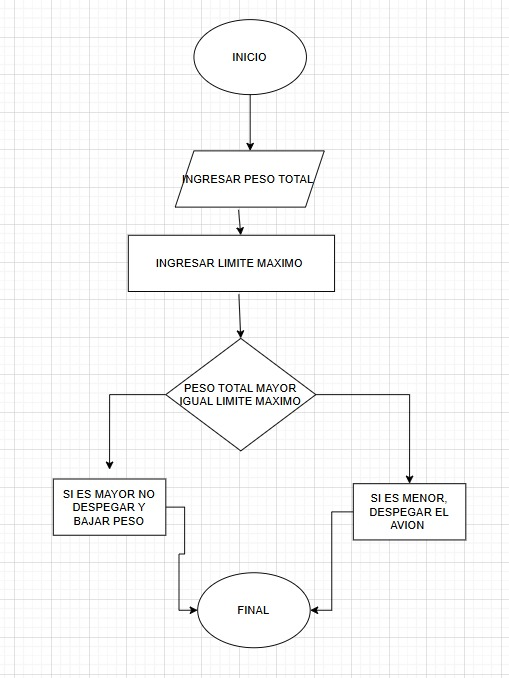

## EJERCICIOS CON CONDICIONALES

## EJERCICIO 1 

En un pista de pruebas de aeronaves, el sistema debe verificar si el peso total de la aeronave, inlcuyendo combustible y carga, supera el limite maximo permitido para el despegue. Depedndiendo del resultado, el sistema debera indicar si la aeronave esta lista para despegar o si debe reducir carga p combustible.

## EJERCICIO 2

Durante una inspeccionde rutina, se mide la temperatura de un motot de turbina. Si la temperatura es mayor a un valor critico, se debe indicar "Peligro: sobrecalentamiento". si esta dentro del rango seguro, indicar "Operacion normal". si es demasiado baja, indicar "Calentar antes de operar".

## EJERCICIO 4

Durante un ensayo el banco de un motor a reaccion, se mide el nivel de combustible cada minuto y se detiene el registro cuando el combustible baja del 10%. Mostrar el tiempo total de operacion 

## EJERCICIO 6

Un sistema de temperatura mide cada 5 minutos la temperatura en una cabina durante una hora. Si en algun momento detecta una temperatura mayor a 27C o menos a 18C debe indicar que se active el sistema de climatizacion

