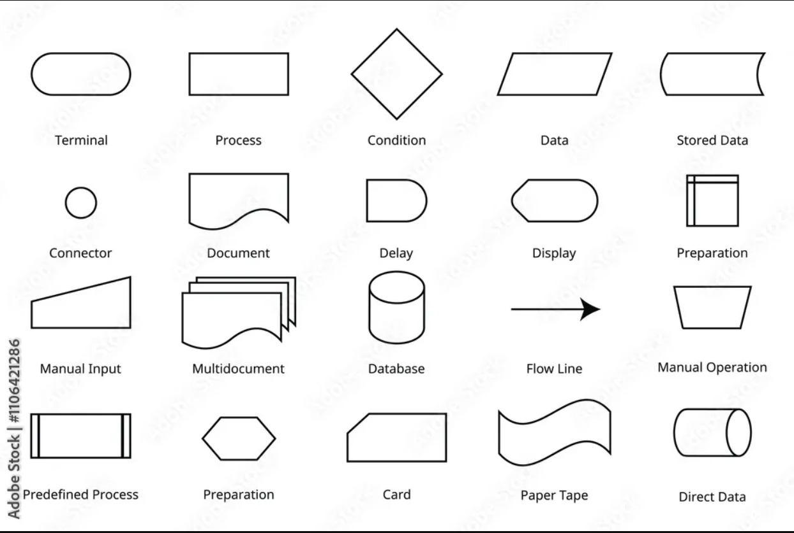

## 📤 Ejercicio 1.

Investiga cuáles son los símbolos que se utilizan para representar cada operación de un algorimo con un diagrama de flujo. Asegúrate de que la fuente es confiable, discute lo que encontraste con tus compañeros y con el profe. Cuando estés seguro/a de tener los símbolos correctos, consigna la información en la bitácora.

- Símbolos básicos

Inicio / Fin (Terminator) = Óvalo / “pastilla”
Se usa para marcar el comienzo y el final del algoritmo.

Proceso (Process) = Rectángulo
Representa una acción/operación: calcular, asignar, sumar, restar, etc.

Decisión (Decision) = Rombo
Representa una condición (Sí/No, Verdadero/Falso) que divide el flujo.

Entrada / Salida (Input/Output o Data) = Paralelogramo
Se usa para leer datos (input) o mostrar/imprimir resultados (output).

Líneas de flujo (Flow lines) = Flechas
Muestran el orden y la dirección de ejecución.

- Símbolos muy comunes

Subproceso / Proceso predefinido (Predefined process / Subprocess) = Rectángulo con doble borde
Para un bloque de pasos definido en otra parte (función/procedimiento).

Conector (Connector) = Círculo pequeño (en la misma página)
Para “saltar” a otra parte del diagrama sin cruzar flechas.

Documento (Document) = Rectángulo con base ondulada
Cuando el resultado o entrada es un documento/reporte (según la convención usada). (Aparece en conjuntos de símbolos estandarizados/convencionales).

Datos almacenados / Base de datos (Stored data / Database) = Cilindro
Para datos guardados en un archivo o BD (según el set de símbolos).

Fuentes

ISO 5807:1985 (estándar internacional de símbolos y convenciones de diagramas de flujo).

NIST (FIPS PUB 24): documento del gobierno de EE. UU. sobre símbolos y uniformidad en flowcharts.

## 📔 Reglas para el uso de diagramas de flujo

1. Todo diagrama de flujo debe tener un **inicio y** un **fin.** 
2. Las líneas utilizadas para indicar la dirección del flujo del diagrama deben ser rectas: verticales u horizontales. 
3. Todas las líneas utilizadas para indicar la dirección del flujo del diagrama deben estar conectadas. La conexión puede ser a un símbolo que exprese lectura, proceso, decisión, impresión, conexión o fin del diagrama. 
4. El diagrama de flujo debe construirse de arriba hacia abajo (*top-down*) y de izquierda a derecha (*left to right* ).
5. La notación utilizada en el diagrama de flujo debe ser  independiente del lenguaje de programación. 
6. Al realizar una tarea compleja, es conveniente poner  comentarios que expresen o ayuden a entender lo que  hayamos hecho. 
7. Si la construcción del diagrama de flujo requiriera más de  una hoja, debemos utilizar los conectores adecuados y  enumerar las páginas correspondientes. 
8. No puede llegar más de una línea a un símbolo  determinado

### Un acuario necesita determinar cuantos litros o galones de agua caben en un acuario, pero solo dispone de una cinta metrica. Diseña un algoritmo para solucionar el problema.

**DATOS DE ENTRADA**
- LARGO
- ANCHO
- ALTO
- UNIDAD DE SALIDA

**DATOS DE SALIDA**
- VOLUMEN EN LITROS 
- VOLUMEN EN GALONES

**PSEUDOCODIGO**
INICIO
MOSTRAR "Por favor ingrese las medidas del tanque"
Leer Largo, Ancho y Alto
Mostrar "Ingresa L para litros y G para galones"
Leer Unidad

Volumen=Largo*Ancho*Alto //Volumen en cm^3 equivalente a ml
Volumen lt=Volumen/1000 // en Litros 

Si Unidad ="G"
          Volumen gl=Volumen lt*2.2
          Mostrar Volumen gl
Si no
        Mostrar Volumen lt
Fin si
Fin

### Realice un algoritmo para determinar cuánto se debe pagar por equis cantidad de lápices considerando que si son 1000 o más el costo es de $85 cada uno; de lo contrario, el precio es de $90. Represéntelo con el pseudocódigo y el diagrama de flujo.

**DATOS DE ENTRADA**

|VARIABLE| NOMBRE | DESCRIPCION |
|------- | ----------- | ------- |
| X |LAPIZ | CANTIDAD DE LAPICES |

**DATOS DE SALIDA**

|VARIABLE|DESCRIPCION|
|------|--------|
|UNIDAD|VALOR DEL LAPIZ|
|TOTAL|CUANTO ES EL TOTAL|

INICIO
Mostrar "Por favor ingrese la cantidad de lapices"
Leer CANTIDAD
Si cantidad mayor igual 1000
Unidad=85
Si no
Unidad=90
Fin si
Total=Cantidad*Unidad
Mostrar total
Fin

# Ejercicios 
## PSEUDOCODIGO

INICIO
MIENTRAS VA!= -1
     LEER VA

### EJERCICIO 3
Escriba un algortimo para imprimir los numeros del 5 hasta el 5000 ( multiplos de 5) utilizando bucle for
INICIO 
Desde N=5 hasta N=5000,  N=N+5
     Mostrar N
Fin desde 
fin

#### EJERCICIO 4
Se requiere un algoritmo para determinar, de N cantidades ingresadas por teclado, cuantas son cero, cuantas son menores a cero y cuantas son mayores a cero 

INICIO
Leer N

ceros=0
Positivos=0
Negativos=0

Mientras 
Si N=0, Ceros =Ceros +1
